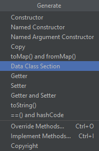

# Dart Data Class Plugin

This plugin is created for those who would like to use `copyWith` methods and do not like to write boilerplate.

Also has `toMap` and `fromMap` methods generator which is needed for Sqlite.



This plugin can generate the following code:
- Named Argument Constructor
- `copyWith`: copies the instance and overrides the given parameters *(you can name specify this method's name in the settings)*
- `toMap`: converts your class into a map of `Map<String, dynamic>`
- `fromMap`: constructs your class from a `Map<String, dynamic>` using the named argument constructor

---

## Example

Let's say you have a class called `Person` with the properties:

```dart
class Person {
  final int id;
  final String _firstName, _lastName;
  final int age;

  String get name => _firstName + " " + _lastName;
}
```

Using all generators of this plugin and selecting all properties, this class will look like this:


```dart
class Person {
  final int id;
  final String _firstName, _lastName;
  final int age;

  String get name => _firstName + " " + _lastName;

  Person({
    this.id,
    this.age,
    String firstName,
    String lastName,
  })
      : _firstName = firstName,
        _lastName = lastName;

  Person copyWith({
    int id,
    String firstName,
    String lastName,
    int age,
  }) {
    return new Person(
      id: id ?? this.id,
      firstName: firstName ?? this._firstName,
      lastName: lastName ?? this._lastName,
      age: age ?? this.age,
    );
  }

  Map<String, dynamic> toMap() {
    return {
      'id': this.id,
      '_firstName': this._firstName,
      '_lastName': this._lastName,
      'age': this.age,
    };
  }

  factory Person.fromMap(Map<String, dynamic> map) {
    return new Person(
      id: map['id'],
      firstName: map['_firstName'],
      lastName: map['_lastName'],
      age: map['age'],
    );
  }

}
```


---

## Settings


You can find additional settings under `Settings` > `Editor` > `Dart Data Class Plugin` where you have the following customization options:

- set the name of the copy method
- use `@required` annotation
- use `new` keyword when instantiation

---

### Under the hood

This project is built using Kotlin and makes use of IntelliJ's PSI elements for extracting the structure of your the Dart file of your selection.
